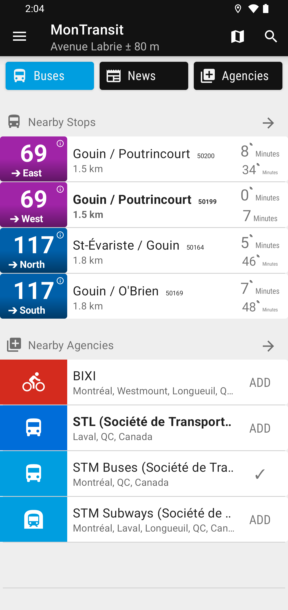
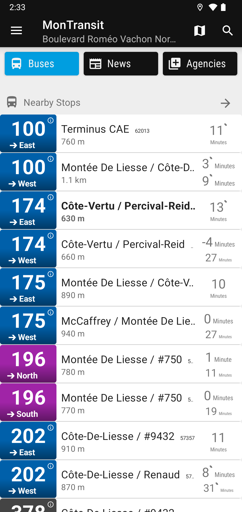
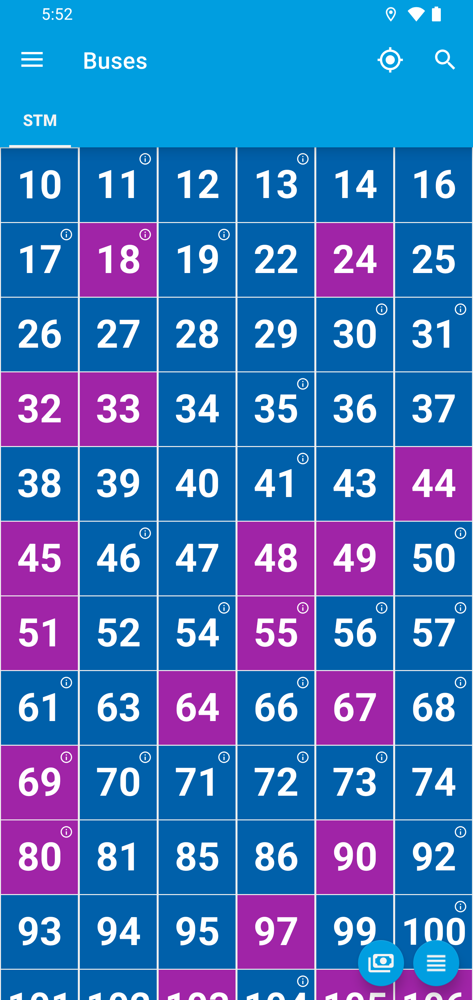

<!-- DO NOT EDIT: this file is generated by MTREADME.md.MT.sh -->
# Société de Transport de Montréal buses for [MonTransit](https://github.com/mtransitapps/mtransit-for-android)

## Download on the Play Store

## Screenshots

## Social

[Facebook](https://www.facebook.com/MonTransit) | [Twitter/X](https://x.com/montransit) | [Instagram](https://www.instagram.com/mtransit.apps) | [Threads](https://www.threads.com/@mtransit.apps)

## License

* [Apache Version 2.0](https://www.apache.org/licenses/LICENSE-2.0.html)
